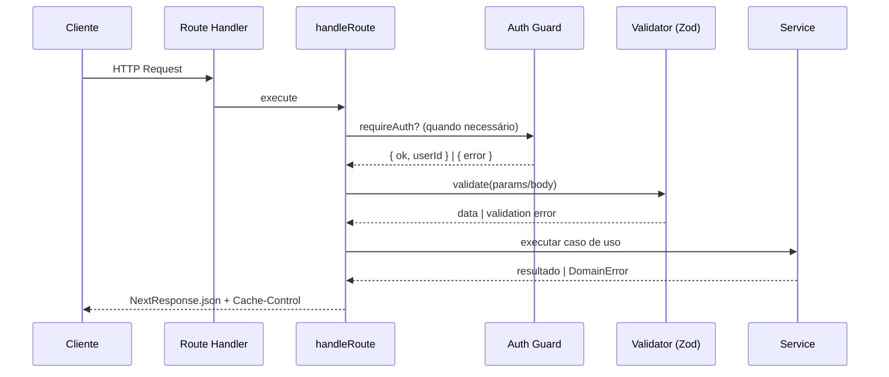

# Arquitetura de APIs (Next.js App Router) — v1.2

Este documento define convenções e padrões para rotas em `app/api/*`, com foco em organização por camadas, validação, tratamento de erros, cache HTTP e exemplos práticos. Visa manter handlers enxutos, previsíveis e fáceis de testar.

## Camadas

Padrões transversais de Cache (resumo)
- Autenticadas: respostas 2xx e erros (401/403/404/422/5xx) → `no-store` via `setNoStore`.
- Públicos (catálogos): `setPublicCache(300, 600)`.
- SSE/Downloads: usar `setSSEHeaders` / `setDownloadHeaders`.

- Rotas/Controllers (`app/api/**/route.ts`)
  - Responsabilidades: orquestrar a requisição, autenticar/autorização (via guard), validar entrada, chamar serviços, e construir a resposta HTTP (status, headers).
  - Deve ser fino e declarativo. Use o wrapper `handleRoute` para padronizar resposta/erros/headers sensíveis a cache.

- Serviços (`services/**/*.ts`)
  - Responsabilidades: encapsular regras de negócio e acesso a dados (Prisma/HTTP/filas).
  - Não importam objetos de Request/Response. Recebem e retornam dados puros (POJOs/DTOs).
  - Tratam casos de domínio (ex.: "conversa não encontrada") com erros de domínio ou retornos opcionais.

- Bibliotecas Compartilhadas (`lib/**`)
  - `lib/auth/guards.ts`: `requireAuth()` centraliza autenticação (retorna `{ ok, userId } | { ok:false, error:{status:number,message:string} }`).
  - `lib/cache/headers.ts`: helpers de cache (`setPublicCache`, `setPrivateCache`, `setNoStore`, `setSSEHeaders`, `setDownloadHeaders`).
  - `lib/http/errors.ts`: helpers de erro HTTP e `handleRoute` para padronização, com correlação e logs estruturados.
  - `lib/validation/zod-helpers.ts`: utilitários de validação (parse/erro).

## Autenticação

- Use `requireAuth()` em rotas que exigem usuário logado.
- Em caso de não autenticado (401/403), aplique `setNoStore` na Response antes de retornar (early-return sem cache).
- Não propagar objetos de sessão para services. Passe `userId` explícito.

Exemplo (early-return padronizado):
```ts
const auth = await requireAuth()
if (!auth.ok) {
  const res = NextResponse.json({ error: 'Unauthorized' }, { status: auth.error.status })
  setNoStore(res)
  return res
}
```
- Em caso de não autenticado, responder com 401/403 (conforme política) sem cache.
- Não propagar objetos de sessão para services. Passe `userId` explícito.

Exemplo:
```ts
// app/api/secure/route.ts
const auth = await requireAuth();
if (!auth.ok) return NextResponse.json({ error: 'Não autorizado' }, { status: auth.error.status });
```

## Validação (Zod)

- Defina schemas por rota/entrada e valide com Zod.
- Em `lib/validation/zod-helpers.ts`:
  - `parseJson(request)` para body JSON seguro.
  - `replyValidationError(error)` para resposta consistente (400 + no-store).
  - `validateWith(schema, data)` atalho para `safeParse` com tipagem. Se retornar `Response`, retorne imediatamente e aplique `setNoStore` (quando necessário).

Padrão:
```ts
const body = await parseJson(req);
const parsed = MySchema.safeParse(body);
if (!parsed.success) return replyValidationError(parsed.error);
// parsed.data já tipado
```

## Tratamento de Erros e Wrapper

- Sempre que possível, envolva handlers com `handleRoute(fn)`:
  - Garante `Cache-Control: no-store` por padrão (override quando aplicável).
  - Converte exceções em respostas JSON consistentes.
  - Ponto único para mapear erros de domínio → status HTTP (extensível).

Exemplo:
```ts
export async function GET() {
  return handleRoute(async () => {
    // ... lógica
    const res = NextResponse.json(data);
    setNoStore(res); // ou sobrescrever com setPublicCache / setPrivateCache
    return res;
  });
}
```

## Cache HTTP

Política geral (ver também `docs/api-cache-strategy.md`):

- Pública estática/diagnósticos: `setPublicCache(res, 300, 600)` ou maior se aplicável.
- Autenticado sensível/volátil: `setNoStore(res)` (ex.: saldos, histórico).
- Mutations (POST/PATCH/DELETE): em geral, `no-store`.
- Streaming (SSE): `setSSEHeaders(res)`.
- Downloads: `setDownloadHeaders(res, filename, contentType)` e geralmente `no-store` (ou curto ttl dependendo do conteúdo).

Exemplos aplicados:
- `credits/balance` e `credits/history`: `no-store`.
- `credits/packages`: público `max-age=300, stale-while-revalidate=600`.

## Exemplos Práticos

### 1) Rota Autenticada com Service + handleRoute (saldo)

Arquivo: `app/api/credits/balance/route.ts`
```ts
import { NextResponse } from 'next/server'
import { requireAuth } from '@/lib/auth/guards'
import { setNoStore } from '@/lib/cache/headers'
import { handleRoute } from '@/lib/http/errors'
import { CreditsService } from '@/services/credits'

export async function GET() {
  return handleRoute(async () => {
    const auth = await requireAuth()
    if (!auth.ok) {
      return NextResponse.json({ error: 'Não autorizado' }, { status: auth.error.status })
    }

    const balance = await CreditsService.getUserBalance(auth.userId)
    const res = NextResponse.json({ balance, isLowBalance: balance < 100 })
    setNoStore(res)
    return res
  })
}
```

Pontos-chave:
- Guard antes do service.
- Service não conhece `Request/Response`.
- `handleRoute` + `setNoStore`.

### 2) Rota Pública com Cache (catálogo de pacotes)

Arquivo: `app/api/credits/packages/route.ts`
```ts
import { NextResponse } from 'next/server'
import { setPublicCache } from '@/lib/cache/headers'
import { CreditsService } from '@/services/credits'
import { handleRoute } from '@/lib/http/errors'

export async function GET() {
  return handleRoute(async () => {
    const packages = await CreditsService.getAvailablePackages()
    const res = NextResponse.json({ packages })
    setPublicCache(res, 300, 600)
    return res
  })
}
```

Pontos-chave:
- Público: `setPublicCache`.
- Envolto por `handleRoute` (consistência de erro/logs).

### 3) Histórico com paginação e filtros

Arquivo: `app/api/credits/history/route.ts`
```ts
import { NextRequest, NextResponse } from 'next/server'
import { requireAuth } from '@/lib/auth/guards'
import { setNoStore } from '@/lib/cache/headers'
import { handleRoute } from '@/lib/http/errors'
import { CreditsService } from '@/services/credits'

export async function GET(request: NextRequest) {
  return handleRoute(async () => {
    const auth = await requireAuth()
    if (!auth.ok) {
      return NextResponse.json({ error: 'Não autorizado' }, { status: auth.error.status })
    }

    const url = new URL(request.url)
    const limit = Number.parseInt(url.searchParams.get('limit') || '50')
    const offset = Number.parseInt(url.searchParams.get('offset') || '0')
    const type = url.searchParams.get('type')

    const transactions = await CreditsService.getTransactionHistory(auth.userId, limit, offset)
    const filteredTransactions = type && type !== 'all'
      ? transactions.filter(t => {
          if (type === 'purchase') return ['PURCHASE', 'BONUS'].includes(t.type)
          if (type === 'consumption') return t.type === 'CONSUMPTION'
          return true
        })
      : transactions

    const monthlyStats = await CreditsService.getMonthlyStats(auth.userId)
    const userStats = await CreditsService.getUserCreditStats(auth.userId)

    const res = NextResponse.json({
      transactions: filteredTransactions,
      monthlyStats,
      userStats,
      pagination: {
        limit,
        offset,
        hasMore: transactions.length === limit,
        total: filteredTransactions.length
      }
    })
    setNoStore(res)
    return res
  })
}
```

Pontos-chave:
- Query params seguros (conversão explícita).
- Padrão `no-store`.

## Convenções de Código

- Tipos/DTOs nos services: retornos simples e tipados.
- Evitar `any`. Preferir tipos explícitos/Zod infer.
- Remover imports não usados; manter rotas enxutas.
- Nomes de arquivos:
  - Rota: `app/api/<group>/[...]/route.ts`
  - Service: `services/<domain>.ts`
  - Helpers: `lib/<area>/*.ts`

## Erros e Observabilidade

- `handleRoute(fn)` padroniza a resposta e injeta observabilidade:
  - Mapeia erros de domínio (`DomainError(code, message)`) para status HTTP: 400/401/403/404/409/422/429.
  - Gera e propaga `X-Correlation-Id` em todas as respostas (e logs).
  - Emite logs estruturados (JSON) com: `event`, `level`, `code`, `message`, `details`, `correlationId`.
  - Fallback consistente para 500 com corpo JSON seguro.
- Cabeçalho `X-Correlation-Id`:
  - Se o cliente enviar `X-Correlation-Id`, será reaproveitado; caso contrário, será gerado.
  - Deve ser incluído em requisições de clientes críticos para rastreabilidade ponta-a-ponta.
- Boas práticas:
  - Não fazer `throw` genérico; prefira `DomainError` com `code` claro (ex.: `NOT_FOUND`, `FORBIDDEN`, `VALIDATION`).
  - Em validação Zod, retornar 422 padronizado via wrapper (mapeamento interno).
  - Evitar incluir dados sensíveis em logs. Use `details` com parcimônia.

## Testes e Verificação

- Testar headers de cache por rota (assert `Cache-Control`).
- Testar guarda de auth (401/403 quando inválido).
- Testar validação Zod (422/400 com payload de erros).
- Testar serviços isoladamente (mocks de Prisma).

## Checklist por Rota

- [ ] Usa `handleRoute`.
- [ ] Aplica `requireAuth` se necessário.
- [ ] Validação Zod (quando input).
- [ ] Define cache corretamente (padrão é `no-store`).
- [ ] Chama serviços (sem lógica de domínio no controller).
- [ ] Respostas JSON consistentes.
- [ ] Sem imports/variáveis não usados.

## Organização de Pastas Alvo (Estrutura Sugerida)

```
.
├─ app/
│  └─ api/
│     ├─ templates/
│     │  ├─ route.ts
│     │  └─ [id]/
│     │     ├─ route.ts
│     │     └─ use/
│     │        └─ route.ts
│     ├─ analytics/
│     │  └─ overview/
│     │     └─ route.ts
│     ├─ credits/
│     │  ├─ purchase/route.ts
│     │  ├─ balance/route.ts
│     │  └─ history/route.ts
│     ├─ profile/
│     │  └─ route.ts
│     └─ admin/
│        └─ seed-credits/
│           └─ route.ts
├─ services/
│  ├─ templates.ts
│  ├─ analytics.ts
│  └─ credits.ts
├─ lib/
│  ├─ prisma.ts
│  ├─ auth/
│  │  └─ guards.ts
│  ├─ http/
│  │  └─ errors.ts
│  ├─ cache/
│  │  └─ headers.ts
│  └─ validation/
│     └─ zod-helpers.ts
└─ types/
   └─ dto.ts
```

- Racional: Handlers finos em app/api; regras de negócio em services; utilitários e cross-cutting em lib; DTOs/tipos comuns em types.

## Fluxo de Requisição (Padrão)

1) Envolver o handler com handleRoute.
2) Autenticar quando necessário com requireAuth (não propagar objetos de sessão).
3) Ler params e/ou body de forma segura (parseJson).
4) Validar com Zod; em erro, retornar replyValidationError/DomainError('VALIDATION').
5) Invocar service com dados tipados (sem Request/Response).
6) Construir resposta via NextResponse.json e definir headers de cache apropriados (setNoStore como padrão).
7) handleRoute mapeia erros de domínio → HTTP e injeta observabilidade.

Exemplo de esqueleto:

```ts
export async function GET() {
  return handleRoute(async () => {
    const auth = await requireAuth()
    if (!auth.ok) {
      const res = NextResponse.json({ error: 'Não autorizado' }, { status: auth.error.status })
      setNoStore(res)
      return res
    }

    // validação (quando houver input)
    // const parsed = await validateWith(MySchema, body)
    // if (parsed instanceof Response) return parsed

    const data = await MyService.useCase(auth.userId /*, parsed */)
    const res = NextResponse.json(data)
    setNoStore(res) // ou setPublicCache(...)
    return res
  })
}
```

## Diagrama de Fluxo (Mermaid)



## Padrões Transversais Detalhados

- Autenticação
  - Guard central requireAuth em lib/auth/guards.ts.
  - Não usar getServerSession diretamente em rotas; padronizar via guard.

- Validação (Zod)
  - Definir schemas por rota; usar validateWith/parseJson.
  - Em erro, retornar replyValidationError (400/422) ou DomainError('VALIDATION').

- Erros e Mapeamento
  - Usar DomainError(code, message) para casos de domínio.
  - Mapping recomendado (no handleRoute):
    - UNAUTHORIZED → 401
    - FORBIDDEN → 403
    - NOT_FOUND → 404
    - CONFLICT → 409
    - VALIDATION → 422
    - RATE_LIMIT → 429
    - DEFAULT → 500

- Observabilidade
  - `X-Correlation-Id` em resposta e logs (gerado no `handleRoute`).
  - Logs estruturados (rota, status, userId, duração, code de erro/domain).
  - Métricas: contadores por rota/status; histogramas de latência (roadmap).

- Cache HTTP
  - Padrão no-store para autenticadas e mutações.
  - Públicos: setPublicCache(res, ttl, swr).
  - Streaming/Downloads/Webhooks: headers dedicados (SSE/attachment) + no-store.
  - Ver também docs/api-cache-strategy.md.

- Convenções
  - Handlers enxutos; services sem Request/Response.
  - Tipos/DTOs explícitos; remover any; evitar castes desnecessários.
  - Nomenclatura consistente de arquivos e grupos de rota.

## Rate Limiting

- Guard centralizado em `lib/auth/guards.ts`:
  - `applyRateLimit(keyParts: (string|number)[], { windowMs, max, keyPrefix? })`
  - `extractClientIp(headers)` para compor a chave por IP.
- Padrão de uso (após `requireAuth`, antes da operação sensível):
```ts
export async function POST(request: Request) {
  return handleRoute(async () => {
    const auth = await requireAuth()
    if (!auth.ok) {
      const res = NextResponse.json({ error: 'Não autorizado' }, { status: auth.error.status })
      setNoStore(res)
      return res
    }

    const ip = extractClientIp(request.headers)
    const rl = await applyRateLimit([ip, auth.userId, 'op_tag'], { windowMs: 60_000, max: 5 })
    if (rl) {
      setNoStore(rl)
      return rl // 429 com Retry-After e X-RateLimit-*
    }

    // ... operação ...
  })
}
```
- Recomendações:
  - Para mutações de alto impacto (ex.: compra de créditos, seed/admin, deleção de conta, limpeza de dados), iniciar com limites conservadores (2–5 por 60s).
  - Incluir uma `tag` descritiva na chave (ex.: `'credits_purchase'`, `'user_delete'`, `'user_clear_data'`).
  - Respeitar idempotência: quando possível, usar 204/200 sem payload grande para evitar replays caros.
  - O guard retorna `Response` 429 com cabeçalhos: `Retry-After`, `X-RateLimit-Limit`, `X-RateLimit-Remaining`, `X-RateLimit-Reset`.

- GET público (catálogo/estático): handleRoute + setPublicCache(res, 300, 600).
- GET autenticado sensível: handleRoute + requireAuth + setNoStore(res).
- Mutations (POST/PATCH/DELETE): handleRoute + requireAuth (quando aplicável) + setNoStore(res) + validação Zod.
- Streaming (SSE): setSSEHeaders(res).
- Download: setDownloadHeaders(res, filename, contentType) + no-store.

## Segurança e Headers

- Os helpers de cache de `lib/cache/headers.ts` aplicam automaticamente headers de segurança:
  - HSTS (`Strict-Transport-Security`), `X-Content-Type-Options: nosniff`,
    `X-Frame-Options: DENY`, `Referrer-Policy: no-referrer`,
    `Permissions-Policy` (restritiva).
- Implicações:
  - Sempre use `setNoStore`, `setPublicCache`, `setPrivateCache`, `setSSEHeaders`, `setDownloadHeaders` para construir a resposta.
  - Opcionalmente, CSP pode ser adicionada no futuro conforme necessidades de UI (comentado no helper).
  - Para SSE/Downloads, usar os helpers específicos, que também aplicam os headers de segurança.

- Consolidar uso de requireAuth em todas as rotas (remover getServerSession remanescente).
- Padronizar NextResponse.json em vez de Response cru quando retornando JSON.
- Garantir setNoStore em toda resposta autenticada/sensível.
- Centralizar validações com validateWith e schemas locais por rota.
- Substituir increment/decrement de contadores por checagens de permissão antes da escrita (evitar rollback).
- Tipar reducers/aggregations para eliminar any e casts desnecessários.
- Remover imports/variáveis não usados e alinhar lint.

## Plano Detalhado & Difs Sugeridos (Semânticos)

- lib/http/errors.ts
  - Adicionar mapeamento de DomainError → status HTTP e injeção de Correlation-Id.
  - Estruturar logs com { route, method, status, userId, durationMs, errorCode }.

- lib/auth/guards.ts
  - Confirmar contrato de retorno e mensagens padronizadas (401/403).

- Rotas existentes
  - Envolver com handleRoute, aplicar requireAuth quando necessário.
  - Definir cache por tipo (no-store por padrão; público com TTL/SWR quando aplicável).
  - Adicionar validação Zod nas mutações.

- Services
  - Extrair regras de negócio residuais dos handlers para services/<domínio>.ts.
  - Introduzir DTOs de entrada/saída quando necessário.

- Testes
  - Contratos simples garantindo Cache-Control e códigos em casos de erro de validação/autorização.

---

Versão: 1.1