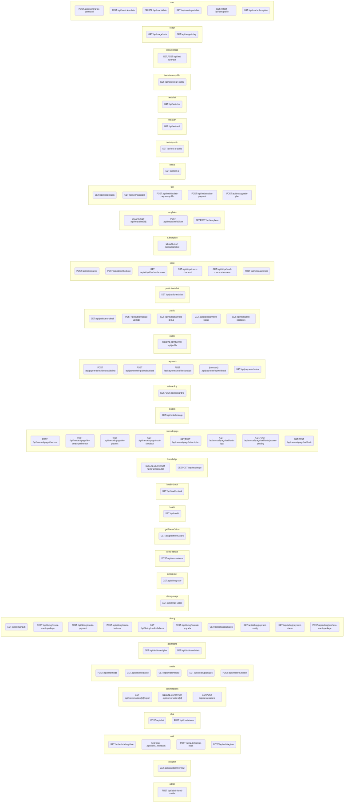

# Endpoints da API por Domínio

Visão geral dos endpoints (App Router) agrupados pelo primeiro segmento após `/api/`. Cada nó exibe o(s) método(s) HTTP detectado(s) e o caminho.

```mermaid
flowchart LR
  %% Auto-generated from file structure
  subgraph admin
    n_admin_1[POST /api/admin/seed-credits]
  end

  subgraph analytics
    n_analytics_1[GET /api/analytics/overview]
  end

  subgraph auth
    n_auth_1[GET /api/auth/debug/clear]
    n_auth_2[(unknown) /api/auth/[...nextauth]]
    n_auth_3[POST /api/auth/register-mock]
    n_auth_4[POST /api/auth/register]
  end

  subgraph chat
    n_chat_1[POST /api/chat]
    n_chat_2[POST /api/chat/stream]
  end

  subgraph conversations
    n_conversations_1[GET /api/conversations/[id]/export]
    n_conversations_2[DELETE,GET,PATCH /api/conversations/[id]]
    n_conversations_3[GET,POST /api/conversations]
  end

  subgraph credits
    n_credits_1[POST /api/credits/add]
    n_credits_2[GET /api/credits/balance]
    n_credits_3[GET /api/credits/history]
    n_credits_4[GET /api/credits/packages]
    n_credits_5[POST /api/credits/purchase]
  end

  subgraph dashboard
    n_dashboard_1[GET /api/dashboard/plan]
    n_dashboard_2[GET /api/dashboard/stats]
  end

  subgraph debug
    n_debug_1[GET /api/debug/auth]
    n_debug_2[POST /api/debug/create-credit-package]
    n_debug_3[POST /api/debug/create-payment]
    n_debug_4[POST /api/debug/create-test-user]
    n_debug_5[GET /api/debug/credits/balance]
    n_debug_6[POST /api/debug/manual-upgrade]
    n_debug_7[GET /api/debug/packages]
    n_debug_8[GET /api/debug/payment-config]
    n_debug_9[GET /api/debug/payment-status]
    n_debug_10[POST /api/debug/purchase-credit-package]
  end

  subgraph debug-usage
    n_debug_usage_1[GET /api/debug-usage]
  end

  subgraph debug-user
    n_debug_user_1[GET /api/debug-user]
  end

  subgraph demo-stream
    n_demo_stream_1[POST /api/demo-stream]
  end

  subgraph getThemeColors
    n_getThemeColors_1[GET /api/getThemeColors]
  end

  subgraph health
    n_health_1[GET /api/health]
  end

  subgraph health-check
    n_health_check_1[GET /api/health-check]
  end

  subgraph knowledge
    n_knowledge_1[DELETE,GET,PATCH /api/knowledge/[id]]
    n_knowledge_2[GET,POST /api/knowledge]
  end

  subgraph mercadopago
    n_mercadopago_1[POST /api/mercadopago/checkout]
    n_mercadopago_2[POST /api/mercadopago/dev-create-preference]
    n_mercadopago_3[POST /api/mercadopago/dev-process]
    n_mercadopago_4[GET /api/mercadopago/mock-checkout]
    n_mercadopago_5[GET,POST /api/mercadopago/subscription]
    n_mercadopago_6[GET /api/mercadopago/webhook-logs]
    n_mercadopago_7[GET,POST /api/mercadopago/webhook/process-pending]
    n_mercadopago_8[GET,POST /api/mercadopago/webhook]
  end

  subgraph models
    n_models_1[GET /api/models/usage]
  end

  subgraph onboarding
    n_onboarding_1[GET,POST /api/onboarding]
  end

  subgraph payments
    n_payments_1[POST /api/payments/mp/checkout/boleto]
    n_payments_2[POST /api/payments/mp/checkout/card]
    n_payments_3[POST /api/payments/mp/checkout/pix]
    n_payments_4[(unknown) /api/payments/mp/webhook]
    n_payments_5[GET /api/payments/status]
  end

  subgraph profile
    n_profile_1[DELETE,GET,PATCH /api/profile]
  end

  subgraph public
    n_public_1[GET /api/public/env-check]
    n_public_2[POST /api/public/manual-upgrade]
    n_public_3[GET /api/public/payment-debug]
    n_public_4[GET /api/public/payment-status]
    n_public_5[GET /api/public/test-packages]
  end

  subgraph public-test-chat
    n_public_test_chat_1[GET /api/public-test-chat]
  end

  subgraph stripe
    n_stripe_1[POST /api/stripe/cancel]
    n_stripe_2[POST /api/stripe/checkout]
    n_stripe_3[GET /api/stripe/checkout/success]
    n_stripe_4[GET /api/stripe/mock-checkout]
    n_stripe_5[GET /api/stripe/mock-checkout/success]
    n_stripe_6[POST /api/stripe/webhook]
  end

  subgraph subscription
    n_subscription_1[DELETE,GET /api/subscription]
  end

  subgraph templates
    n_templates_1[DELETE,GET /api/templates/[id]]
    n_templates_2[POST /api/templates/[id]/use]
    n_templates_3[GET,POST /api/templates]
  end

  subgraph test
    n_test_1[GET /api/test/ai-status]
    n_test_2[GET /api/test/packages]
    n_test_3[POST /api/test/simulate-payment-public]
    n_test_4[POST /api/test/simulate-payment]
    n_test_5[POST /api/test/upgrade-plan]
  end

  subgraph test-ai
    n_test_ai_1[GET /api/test-ai]
  end

  subgraph test-ai-public
    n_test_ai_public_1[GET /api/test-ai-public]
  end

  subgraph test-auth
    n_test_auth_1[GET /api/test-auth]
  end

  subgraph test-chat
    n_test_chat_1[GET /api/test-chat]
  end

  subgraph test-stream-public
    n_test_stream_public_1[GET /api/test-stream-public]
  end

  subgraph test-webhook
    n_test_webhook_1[GET,POST /api/test-webhook]
  end

  subgraph usage
    n_usage_1[GET /api/usage/stats]
    n_usage_2[GET /api/usage/today]
  end

  subgraph user
    n_user_1[POST /api/user/change-password]
    n_user_2[POST /api/user/clear-data]
    n_user_3[DELETE /api/user/delete]
    n_user_4[GET /api/user/export-data]
    n_user_5[GET,PATCH /api/user/profile]
    n_user_6[GET /api/user/subscription]
  end
```

Renderizado (SVG):


Renderizado (PNG):


Notas
- Extraído diretamente do filesystem (`app/api/**/route.ts(x)|js(x)`) e inspeção de métodos exportados (`GET`, `POST`, etc.).
- Segmentos dinâmicos aparecem entre colchetes (ex.: `[id]`).
- Alguns handlers podem ter múltiplos métodos; onde não foi possível inferir, anotado como `(unknown)`.
