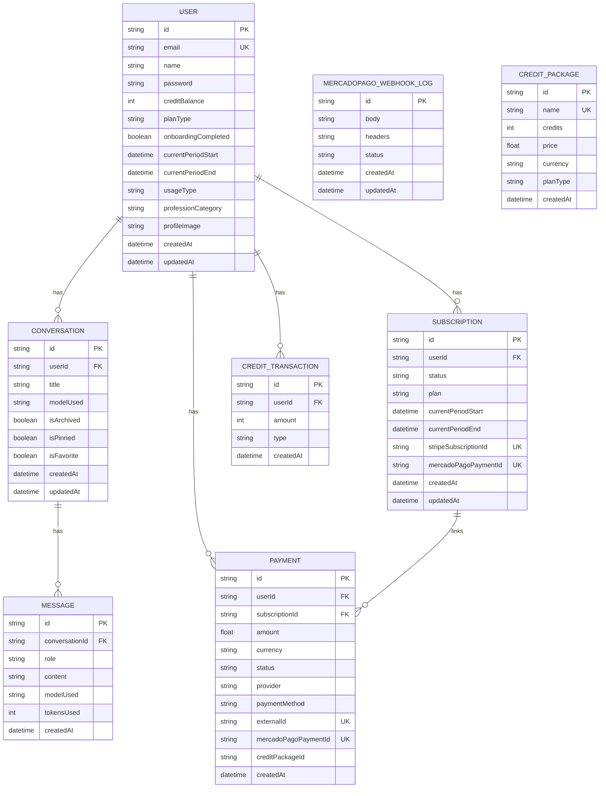

# Modelo de Dados — Prisma

Diagrama entidade-relacionamento derivado de `prisma/schema.prisma`.

Observações
- Índices e constraints de unicidade seguem o schema Prisma (verifique `@@index`/`@unique`).
- A funcionalidade de telemetria de uso (`lib/usage-limits.ts`) pode depender de uma tabela opcional `UserUsage` não presente no schema atual; em deploys sem essa tabela, o rastreamento é automaticamente ignorado.

