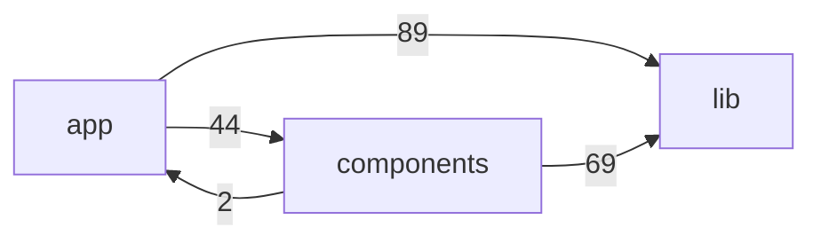
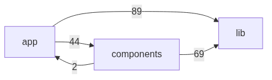

# Dependências por Pastas (app / components / lib)

Este diagrama mostra, em alto nível, como os diretórios se referenciam via imports. Os números nas setas representam aproximadamente quantos arquivos da pasta de origem importam algo da pasta destino.

Renderizado (SVG):

Renderizado (PNG):

Notas
- Contagem aproximada: baseada em uma varredura de imports (incluindo alias `@/…` e caminhos relativos que contenham `lib/`, `components/` ou `app/`).
- `lib` é a base estável (não importa `app` nem `components`), enquanto `app` consome fortemente `lib` e também `components`.
- Há poucos imports de `components` para `app`, sugerindo bom isolamento de UI vs. rotas, com algumas exceções pontuais.
