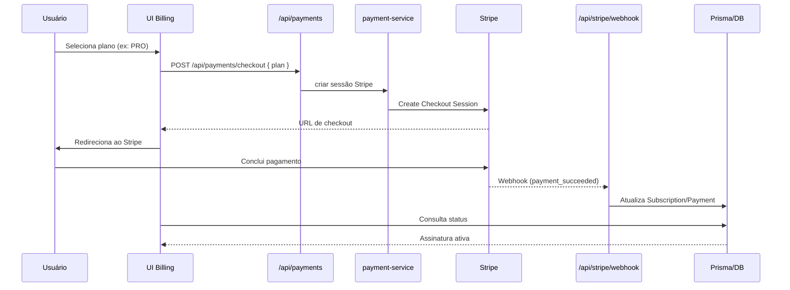

# Pagamentos — Stripe e Mercado Pago

Visão dos fluxos de cobrança por assinaturas e pacotes de créditos.

```mermaid
flowchart LR
  subgraph UI
    U[Usuário]
    DSH[Dashboard / Billing]
  end

  subgraph API
    PAY[/api/payments/*]
    STRIPE[/api/stripe/*]
    MP[/api/mercadopago/*]
  end

  subgraph Lib
    SVC[lib/payments/payment-service]
    SUB[Subscription Service]
    PRIS[lib/prisma]
  end

  subgraph Externo
    ST[(Stripe)]
    MPG[(Mercado Pago)]
  end

  U --> DSH --> PAY
  PAY --> SVC
  SVC --> ST
  SVC --> MPG
  ST --> STRIPE
  MPG --> MP
  STRIPE --> PRIS
  MP --> PRIS
```



Mercado Pago — visão geral
- Criação de preferência de pagamento e retorno (sandbox/produção) via SDK `mercadopago`.
- Webhook em `/api/mercadopago/webhook` armazena logs (`MercadoPagoWebhookLog`) e reconcilia pagamentos/assinaturas.

Tabelas relacionadas
- `Subscription` com referência opcional a `Payment`.
- `Payment` com `externalId`/`mercadoPagoPaymentId` para idempotência.

Variáveis necessárias (resumo)
- Stripe: `STRIPE_SECRET_KEY`, `NEXT_PUBLIC_STRIPE_PUBLISHABLE_KEY`, `STRIPE_WEBHOOK_SECRET`, `STRIPE_PRICE_*`.
- Mercado Pago: `MERCADOPAGO_ACCESS_TOKEN`, `NEXT_PUBLIC_MERCADOPAGO_PUBLIC_KEY`, `MERCADOPAGO_WEBHOOK_SECRET`.

