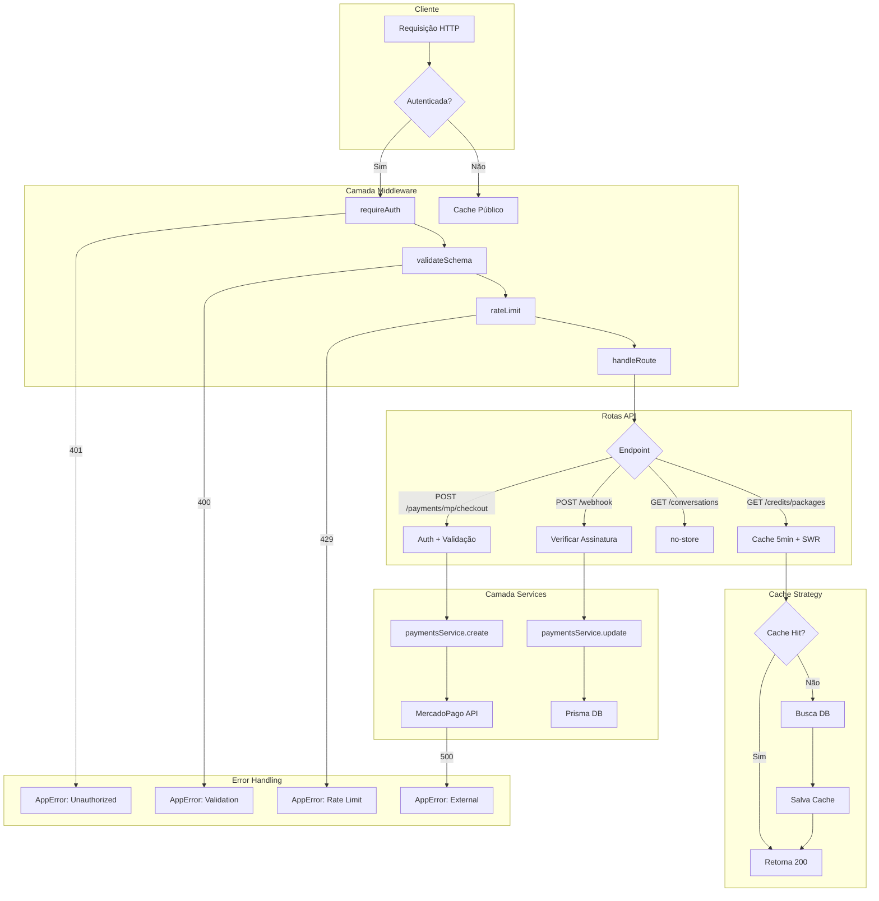
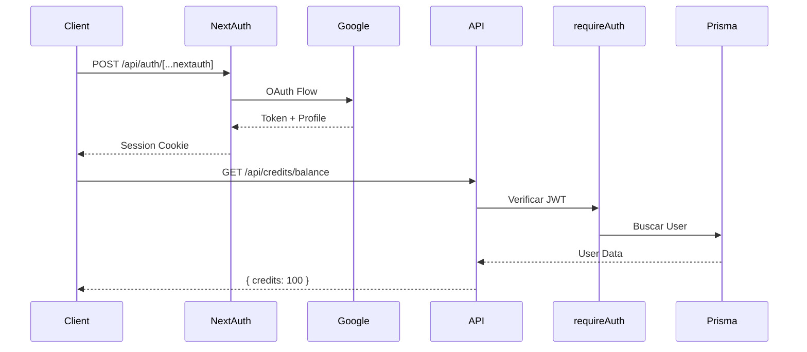

# Diagrama de Fluxo de Requisição – API InnerAI

## 🧩 Pontos de Cache & Validação

| Endpoint | Cache | Validação | Auth | Observações |
|----------|-------|-----------|------|-------------|
| `GET /credits/packages` | `public, max-age=300, stale-while-revalidate=600` | Zod | ❌ | Catálogo público |
| `GET /credits/balance` | `no-store` | — | ✅ | Dados sensíveis |
| `POST /payments/mp/checkout/*` | `no-store` | Zod | ✅ | Transação única |
| `GET /conversations` | `no-store` | — | ✅ | Lista privada |
| `POST /webhook` | `no-store` | Assinatura MP | ❌ | Externo |
| `GET /templates` | `public, max-age=300` | — | ❌ | Catálogo público |
| `POST /templates` | `no-store` | Zod | ✅ | Criação autenticada |

## 🔐 Fluxo de Autenticação

## 🔄 Invalidação de Cache

- **Pagamento aprovado** → Invalida `GET /credits/balance`
- **Template criado** → Invalida `GET /templates`
- **Perfil atualizado** → Invalida `GET /api/user/profile`

## 📊 Métricas de Observabilidade

| Métrica | Local | Tipo |
|---------|-------|------|
| Tempo de resposta | `handleRoute` | Histogram |
| Erros por endpoint | `AppError` | Counter |
| Cache hit ratio | `cacheHeaders` | Gauge |
| Rate limit hits | `rateLimit` | Counter |
| Webhook processados | `webhook/route.ts` | Counter |